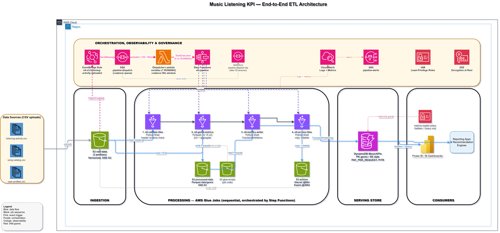
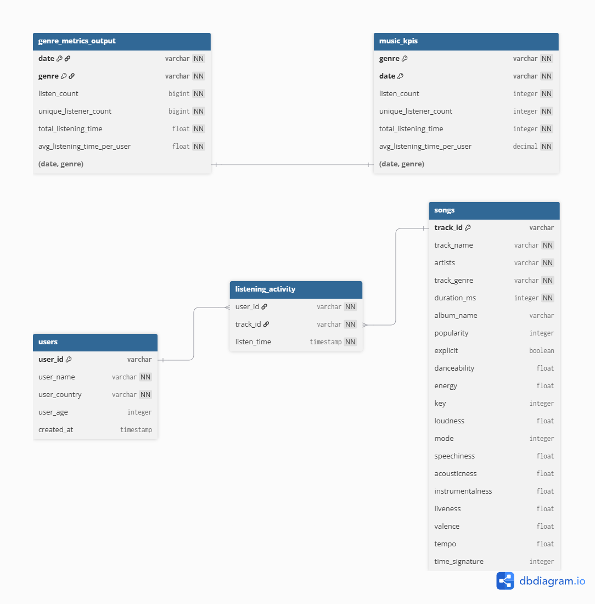

# Music Streaming ETL Pipeline

AWS-native data pipeline for daily genre-level KPI computation from streaming
activity, catalog, and user data. Fully orchestrated by Step Functions with
S3 → EventBridge trigger for zero-touch execution.

---

## Quick Start (End-to-End)

### 1. Prerequisites

- AWS CLI configured with credentials (`aws configure`)
- Terraform >= 1.6 (`terraform -version`)
- Python 3.12+ (`python --version`)
- uv or pip to install project dependencies

### 2. Bootstrap Remote State (first time only)

```bash
cd terraform/bootstrap
terraform init
terraform apply
# Note the S3 bucket name and DynamoDB table name from outputs
cd ..
```

Update `backend.tf` with the actual bucket and table names:

```hcl
terraform {
  backend "s3" {
    bucket         = "<PROJECT>-<ENV>-tfstate-<SUFFIX>"
    key            = "music-streaming-etl/terraform.tfstate"
    region         = "eu-west-1"
    dynamodb_table = "<PROJECT>-<ENV>-tfstate-lock"
    encrypt        = true
  }
}
```

### 3. Deploy Infrastructure

```bash
cd terraform
terraform init
terraform plan
terraform apply
```

Terraform will create:
- **S3 buckets**: raw-data, archive, glue-scripts, processed-data
- **DynamoDB**: MusicKPIs table (genre + date keys)
- **Glue jobs**: etl-validate-files, etl-genre-metrics, etl-metrics-writer, etl-archive-files
- **Step Functions**: etl-pipeline state machine
- **EventBridge**: rule to auto-trigger pipeline on S3 uploads

### 4. Upload Sample Data

```bash
# Get bucket name from terraform output
RAW_BUCKET=$(terraform -chdir=terraform output -raw raw_bucket_id)

aws s3 cp data/streams/streams1.csv s3://${RAW_BUCKET}/listening-activity/
aws s3 cp data/songs/songs.csv s3://${RAW_BUCKET}/song-catalog/
aws s3 cp data/users/users.csv s3://${RAW_BUCKET}/user-profiles/
```

### 5. Trigger Pipeline (Two Options)

#### Option A: Automatic (EventBridge)

The pipeline auto-triggers when any file is uploaded to `listening-activity/`:

```bash
aws s3 cp data/streams/streams2.csv s3://${RAW_BUCKET}/listening-activity/
# Watch the pipeline in AWS Console > Step Functions > etl-pipeline
```

#### Option B: Manual (CLI)

```bash
STATE_MACHINE_ARN=$(terraform -chdir=terraform output -raw etl_pipeline_state_machine_arn)

aws stepfunctions start-execution \
  --state-machine-arn ${STATE_MACHINE_ARN} \
  --input '{"run_date":"2024-06-25","raw_bucket":"'${RAW_BUCKET}'","listening_prefix":"listening-activity/","songs_prefix":"song-catalog/","users_prefix":"user-profiles/","processed_bucket":"'$(terraform -chdir=terraform output -raw processed_bucket_id)'","metrics_table":"MusicKPIs","archive_bucket":"'$(terraform -chdir=terraform output -raw archive_bucket_arn | sed 's/.*://')'"}'
```

### 6. Verify Output

```bash
# Check DynamoDB table for computed metrics
aws dynamodb scan --table-name MusicKPIs --limit 5

# Verify archive bucket received the files
aws s3 ls s3://$(terraform -chdir=terraform output -raw archive_bucket_arn | sed 's/.*://')/listening-activity/
```

---

## Architecture



A burst of `listening-activity/` uploads fires the **EventBridge** rule, which
queues events in **SQS**. The **dispatcher Lambda** coalesces the burst into a
single run and serializes execution (never more than one pipeline RUNNING) before
starting the **Step Functions** state machine: **Validate → Transform → Load →
Archive**. Results land in the **DynamoDB `MusicKPIs`** table; raw inputs move to
the archive bucket. See [`GUIDE.md`](GUIDE.md) for a full plain-English walkthrough.

---

## Running Tests

```bash
# Install dependencies
uv sync  # or: pip install -e ".[dev]"

# Run all tests
pytest

# Run specific test modules
pytest tests/unit/validation/
pytest tests/unit/genre_metrics/
pytest tests/unit/archive/
pytest tests/unit/metrics_writer/
```

---

## Directory Structure

```
.
├── glue_jobs/
│   ├── validation/          # Phase 2: CSV header validation
│   ├── genre_metrics/       # Phase 3: PySpark KPI computation
│   ├── metrics_writer/      # Phase 4: DynamoDB load
│   └── archive/             # Phase 5: S3 file archival
├── step_functions/
│   └── etl_pipeline.asl.json   # State machine definition
├── terraform/
│   ├── modules/             # Reusable modules (s3, glue, iam, dynamodb)
│   ├── main.tf             # Root orchestration
│   ├── variables.tf
│   └── backend.tf
├── tests/
│   └── unit/               # Pytest + moto unit tests
├── data/                   # Sample CSV files
└── README.md
```

---

## Key Design Decisions

| Decision | Rationale |
|----------|-----------|
| **Idempotent re-runs** | Same raw files + same date → overwrites same DynamoDB items |
| **Atomic batch writes** | `TransactWriteItems` (≤25 items/batch) ensures all-or-nothing |
| **Least-priv IAM** | Each Glue job has dedicated role scoped to required resources only |
| **CloudWatch logging** | All jobs emit structured JSON logs and CloudWatch metrics |
| **S3 → EventBridge → SQS → Lambda** | Real-time trigger; the queue + dispatcher coalesce a burst of uploads into one run and serialize executions so runs never overlap |

---

## Troubleshooting

| Symptom | Likely Cause | Fix |
|---------|-------------|-----|
| Validation fails | CSV column names mismatch | Check SCHEMAS in `validate_files.py` match your CSV headers |
| Transform fails | PySpark memory | Increase `num_workers` or use G.1X worker type |
| Load fails | DynamoDB item size > 400KB | Reduce top_N lists upstream |
| Archive fails | IAM permissions | Verify `s3:GetObject`, `s3:PutObject`, `s3:DeleteObject` on archive role |

---

## Data Model



---

## See Also

- [`docs/dynamo-queries.md`](docs/dynamo-queries.md) — Sample DynamoDB queries for KPI lookup
- `specs/` — Detailed design specs for each phase
